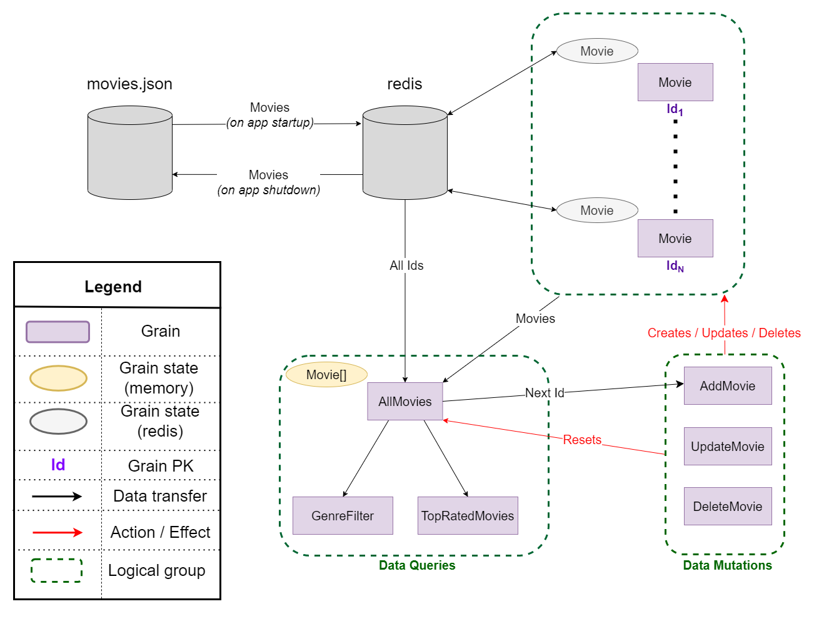
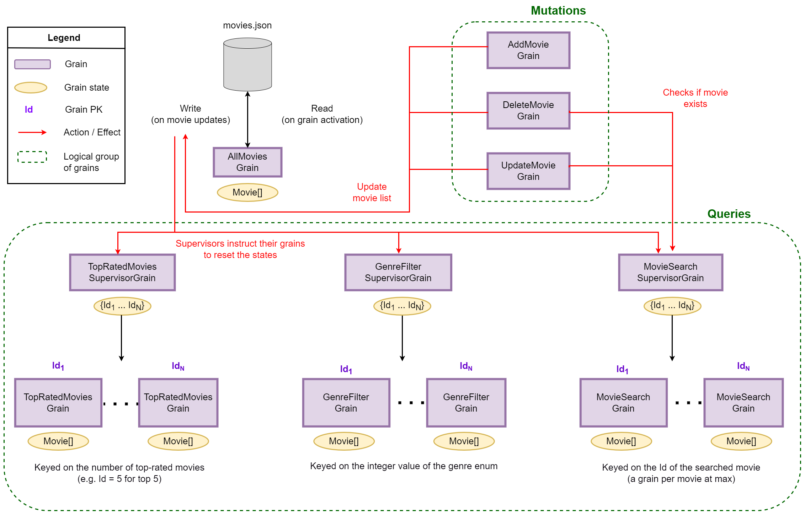

# Running the application
Simply execute [`run.ps1`](./run.ps1)

# Sample GraphQl queries
- GraphQL playground can be accessed via http://localhost:6600/ui/playground
- Sample queries can be found at [SampleGraphqlQueries](./SampleGraphqlQueries.md)

# Design
## Data source
At start-up time, the app reads the movies from [movies.json](movies.json) and loads them into Redis (a key for each movie Id). Grains then work with this set of movies - doing any alterations as the app runs - which is ultimately saved back into file when the app shuts down. This enables any changes done to the movie list to be persisted between different runs. 

## Grains
A grain for each movie exists, whose persistent state is Redis. But apart from the singular movie grains, an `AllMoviesGrain` also exists, which basically maintains a list of all the movies at a centralised grain. This enables the query grains (genre filtering, top rated filtering) to apply the logic on the list of movies this grain provides.

This `AllMoviesGrain`'s in-memory state is kept up-to-date by having it reset whenever there is a change in the movie list (movie addition, update, deletion). This will force it to re-fetch all the movie Ids from Redis again, and call the separate movie grains.

## Alternative approach

Prior to this approach being taken, an alternative design was implemented. It still loaded the movie list in memory, but utilised no other technologies other than Orleans itself. 

It included one `AllMoviesGrain`, whose persistent state was not in memory but the `movies.json` file itself. Any movie updates were directly written to file. 

In addition, the `GenreFilterGrain`, `TopRatedMoviesGrain` and `MovieSearch` were keyed on the genre, amount of top-rated movies, and the search id respectively. The list of movies each returned was kept in memory in the grain state. So this essentially cached the results for multiple requests of the same query. E.g. if two requests came in for the top-5 rated movies, the first request would call `AllMoviesGrain` and save the list of movies in the state. The second one would simply return the list in the state.

To do this effectively though, the states (lists of movie-results) of each of the query grains had to be invalidated / reset whenever there was an update to the movie list. This was achieved by having three supervisor grains (`GenreFilterSupervisorGrain`, `TopRatedSupervisorGrain`, `MovieSearchSupervisorGrain`). Each of the supervisors maintained an in-memory set containing the Ids of the supervised grains (where the Ids represent the variable in the queries; e.g. the amount of top-rated movies to be returned).

Then whenever an update (addition, update, deletion) was done to the original movie list, the supervisors were instructed to reset all their supervised grains' states. 

The implementation for this alternative approach is maintained on a secondary branch [checkpoint/supervisor-implementation-no-redis](https://github.com/neil-scib/movie-index/tree/checkpoint/supervisor-implementation-no-redis), and is also in a fully-working state. It can be run via its version of `run.ps1`, and the same sample graphQL queries mentioned above can be used.

## Verdict

I am still not fully convinced on which one of the two approaches prove to be the more efficient. 

The _no-redis_ approach has the advantage of having **no third party technologies** utilised, thus reducing the external dependencies and the infrastructural orchestration. On the other hand though, it introduces a **bottleneck at the _supervisor_ grains**, since all requests will have to go through them. This can be overcome however, by **deploying multiple sets of the query-grains (supervisor and their supervised grains) on multiple silos**, hence having more resources to service the incoming requests. It also has the disadvantage of the code being more complex to understand and maintain, since the logic is not as straightforward as when we have a grain for each movie.

The same argument of the bottleneck at certain grains can be made against the _redis_ approach. It also has a centralised `AllMoviesGrain`, but at least its read/write latency is less, since it's Redis-backed and not file-based.